# POSIX02 RODRIGUEZ CASTRO ALFONSO / 240300718

# PRIMER PARCIAL

##  TAREA 999

## Descripción:
Crear cuenta en Github y agregar al profesor como colaborador.

###  Capturas
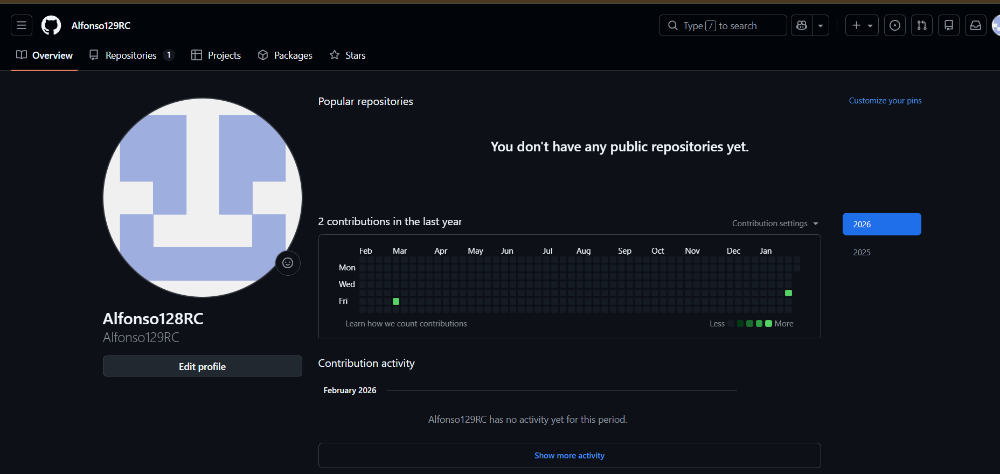

---

## TAREA 998

### Descripción:
Instalar Virtualbox y alguna distribucion de Linux.

### Evidencias:
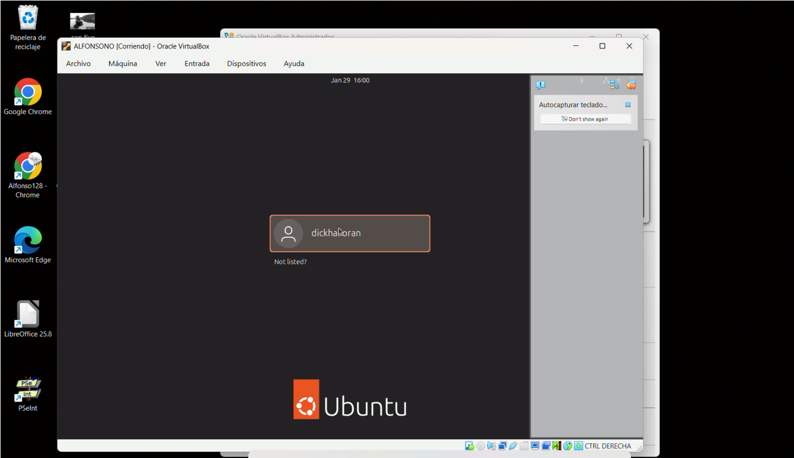

---

## TAREA 997

### Descripción:
Hacer el https://vim-adventures.com/ y sacar un screenshot del ultimo nivel.

### Evidencias:
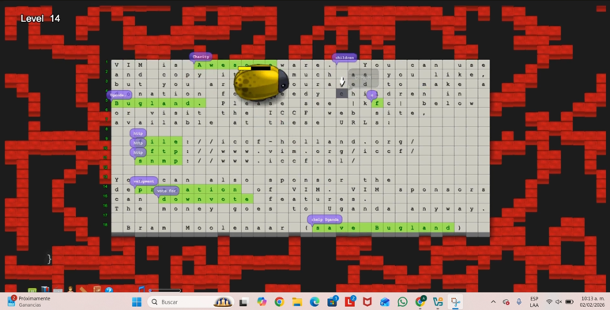
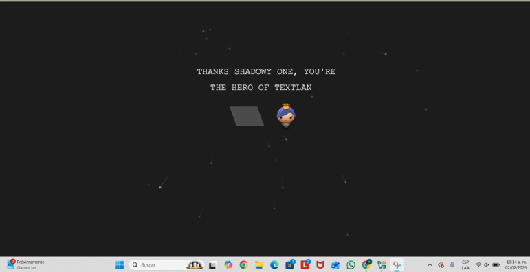

---

## Actividad 996

### Descripción:
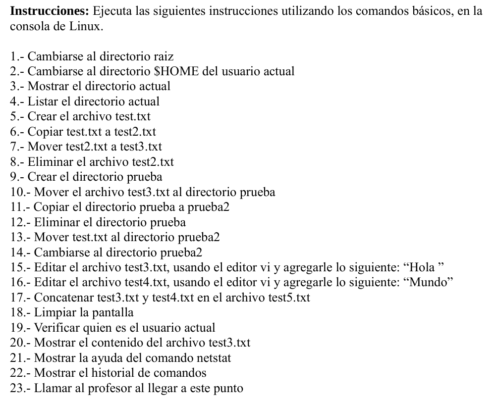

### Evidencias:
Link del Video: https://asciinema.org/a/7w4xi978N2u6Tb0H

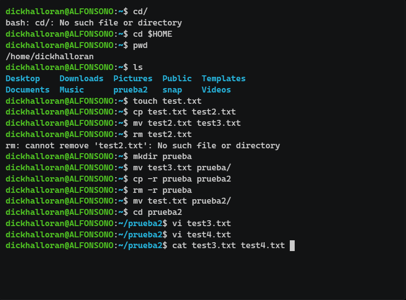

---

## Actividad 995

###  Descripción:
Hacer un menú en bash que permita elegir la ejecución entre el script para crear un árbol de directorios, el script de hola mundo y el script de saludo usando variables y por último la opción de salir.

### Evidencias:
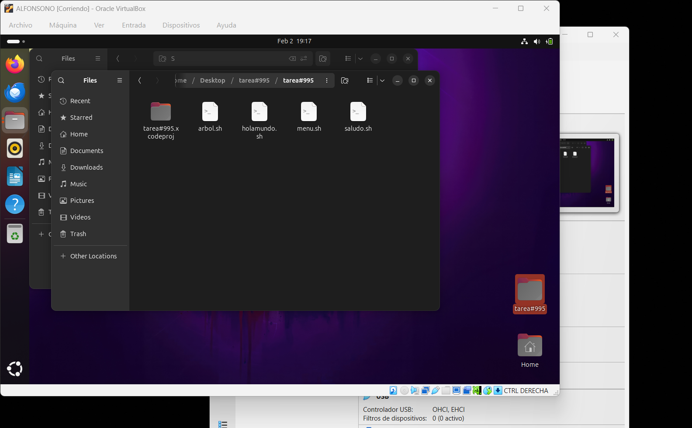
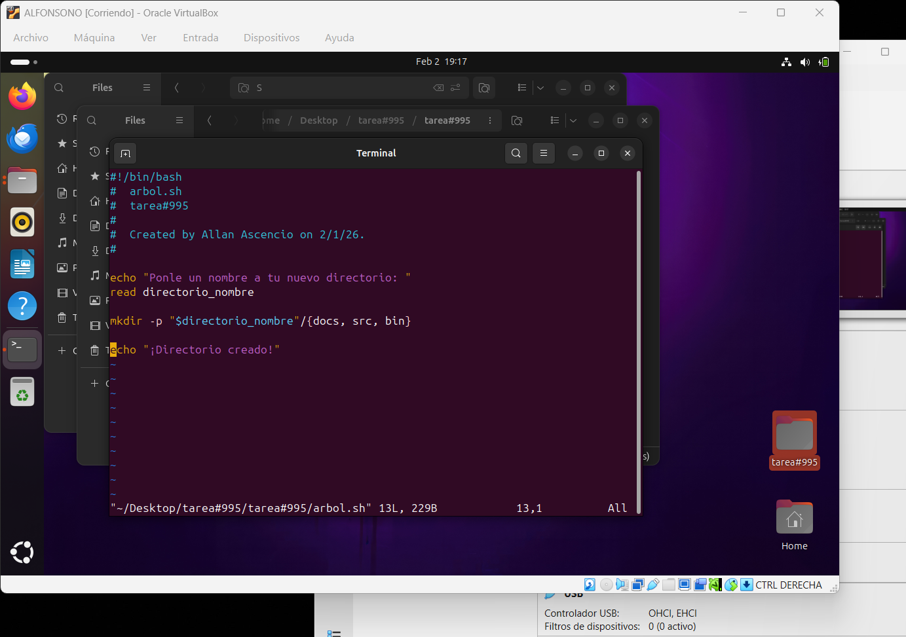

---

## Actividad 994

###  Descripción:
Crear un gif que explique algún concepto, relacionado al curso, que hayas aprendido.
Subir el gif al canal de memes.

### Evidencias:
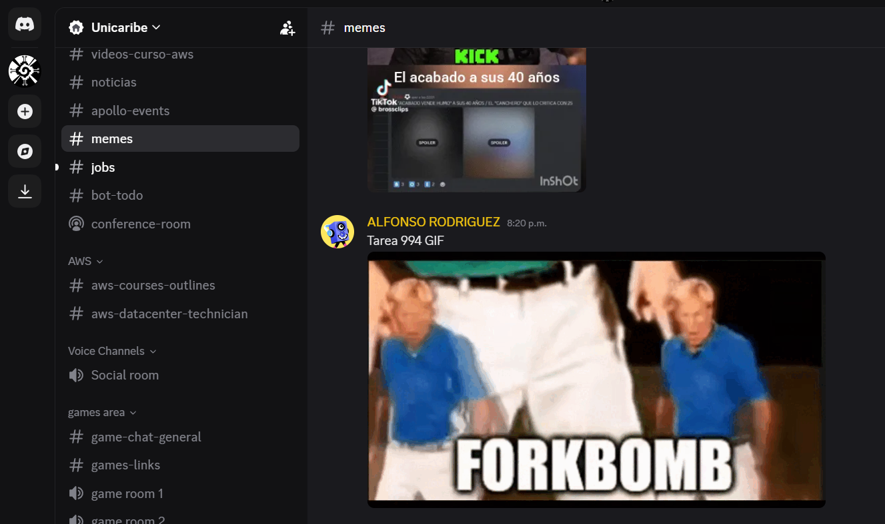

### GIF

---

## Actividad 993

###  Descripción:
Realizar los 18 bash scripts que vienen en el PDF shell_linux.pdf y hacer un menu en bash que permita elegir cada uno, subir el codigo.

### Evidencias:

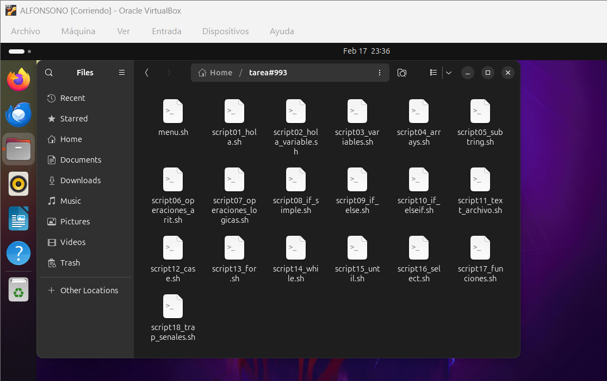

Codigo del Menu:

`#!/bin/bash`

`while true`
`do`
`clear`
`echo "===== MENU SCRIPTS SHELL ====="`
`echo "1) Hola mundo"`
`echo "2) Hola con variable"`
`echo "3) Variables"`
`echo "4) Arrays"`
`echo "5) Substring"`
`echo "6) Operaciones aritméticas"`
`echo "7) Operaciones lógicas"`
`echo "8) If simple"`
`echo "9) If else"`
`echo "10) If elseif"`
`echo "11) Test archivo"`
`echo "12) Case"`
`echo "13) For"`
`echo "14) While"`
`echo "15) Until"`
`echo "16) Select"`
`echo "17) Funciones"`
`echo "18) Trap señales"`
`echo "0) Salir"`
`echo "Seleccione opción: "`
`read opcion`

`case $opcion in`
    `1) ./script01_hola.sh ;;`
    `2) ./script02_hola_variable.sh ;;`
    `3) ./script03_variables.sh ;;`
    `4) ./script04_arrays.sh ;;`
    `5) ./script05_substring.sh ;;`
    `6) ./script06_operaciones_arit.sh ;;`
    `7) ./script07_operaciones_logicas.sh ;;`
    `8) ./script08_if_simple.sh ;;`
    `9) ./script09_if_else.sh ;;`
    `10) ./script10_if_elseif.sh ;;`
    `11) ./script11_test_archivo.sh ;;`
    `12) ./script12_case.sh ;;`
    `13) ./script13_for.sh ;;`
    `14) ./script14_while.sh ;;`
    `15) ./script15_until.sh ;;`
   ` 16) ./script16_select.sh ;;`
  `  17) ./script17_funciones.sh ;;`
 `   18) ./script18_trap_senales.sh ;;`
`    0) exit ;;`
`    *) echo "Opción inválida" ;;`
`esac`

`echo ""`
`read -p "Presiona Enter para continuar..."`
`done`

---

## Actividad 992

###  Descripción:
Compartir una noticia sobre tecnologia/redes/seguridad. Compartir el link en el canal de ⁠noticias.

### Evidencias:
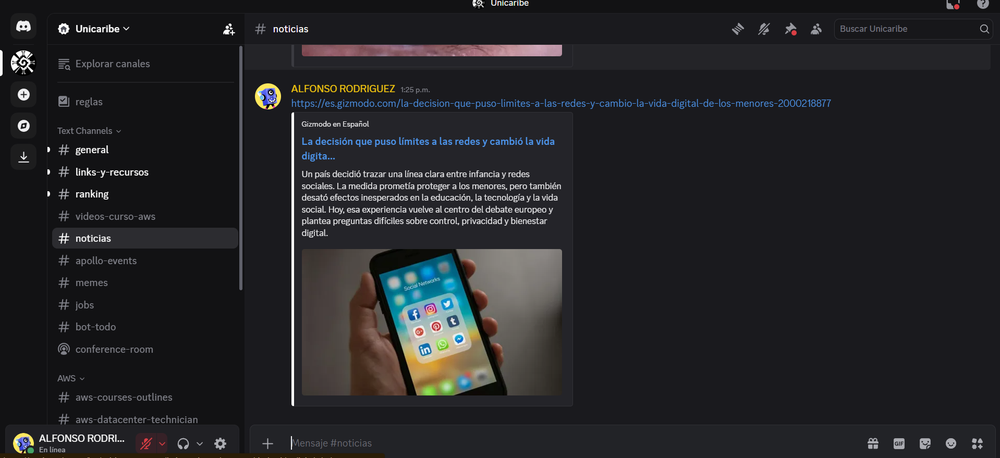
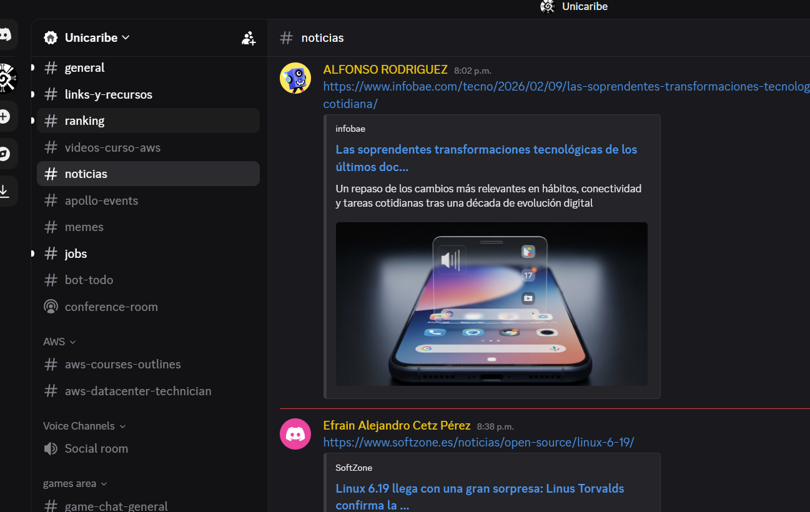

---

## Actividad 991

###  Descripción:
Realizar una investigacion de la unidad 1 y documentar su investigacion en la wiki de su repositorio de tareas.

### Evidencias:

**1) Historia de los S.O. POSIX**

El origen de POSIX está directamente relacionado con el desarrollo de Unix en los años 70 en los laboratorios Bell de AT&T. Unix fue diseñado con una filosofía innovadora para su época: simplicidad, portabilidad y capacidad multiusuario. Fue uno de los primeros sistemas operativos escritos en lenguaje C, lo que facilitó su adaptación a diferentes arquitecturas de hardware.

Durante los años 70 y principios de los 80, Unix se expandió ampliamente en universidades y centros de investigación. Sin embargo, comenzaron a surgir múltiples variantes como BSD (Berkeley Software Distribution) y System V, cada una con implementaciones y comandos ligeramente distintos. Esta fragmentación generó problemas de compatibilidad: un programa que funcionaba en una versión podía no funcionar en otra sin modificaciones.

Para resolver este problema de portabilidad, en 1988 el Institute of Electrical and Electronics Engineers (IEEE) desarrolló el estándar POSIX (Portable Operating System Interface). El objetivo principal era definir una interfaz común basada en Unix que permitiera que el software pudiera compilarse y ejecutarse en distintos sistemas sin necesidad de reescritura significativa.

Posteriormente, el estándar fue adoptado y ampliado por organismos internacionales, incluyendo The Open Group, que integró POSIX dentro de la Single UNIX Specification. Esto ayudó a consolidar una base común para los sistemas tipo Unix modernos.

Con el tiempo, sistemas como Linux, macOS y FreeBSD adoptaron total o parcialmente el estándar POSIX, garantizando compatibilidad y facilitando el desarrollo multiplataforma.
En síntesis, la historia de POSIX surge como una respuesta técnica a la fragmentación del ecosistema Unix, buscando establecer reglas claras que aseguraran coherencia, interoperabilidad y estabilidad en el desarrollo de software.

**2) Definición de los S.O. POSIX**

Un sistema operativo POSIX es aquel que implementa el conjunto de estándares definidos por POSIX, los cuales especifican cómo debe comportarse el sistema operativo en términos de interfaz y funcionalidad. No se trata de un sistema operativo específico, sino de una norma que define reglas técnicas que los sistemas deben cumplir para considerarse compatibles.

El estándar POSIX establece:
Un conjunto formal de llamadas al sistema (system calls).
Una API estandarizada en lenguaje C.
Un modelo común de gestión de procesos y señales.
Un sistema de archivos jerárquico con reglas definidas.
Interfaces para hilos (threads), sincronización y concurrencia.
Un entorno de shell compatible.

Desde el punto de vista conceptual, POSIX define la “interfaz” entre las aplicaciones y el sistema operativo. Es decir, no regula cómo está construido internamente el kernel, sino cómo deben comportarse las funciones que los programas utilizan para interactuar con el sistema.

Esto significa que dos sistemas operativos diferentes pueden tener arquitecturas internas distintas, pero si cumplen con las especificaciones POSIX, un mismo programa puede ejecutarse en ambos con cambios mínimos o nulos en el código fuente.

La importancia de esta definición radica en la portabilidad. En entornos empresariales y académicos, donde el software puede migrar entre servidores, estaciones de trabajo o dispositivos distintos, POSIX garantiza consistencia en:
Manejo de archivos y permisos.
Control de procesos y multitarea.
Comunicación entre procesos.
Entrada y salida estándar.
En resumen, un sistema operativo POSIX es aquel que respeta una especificación formal diseñada para asegurar uniformidad, compatibilidad y estabilidad en el desarrollo y ejecución de software, especialmente en sistemas tipo Unix.

**3) Elementos de los S.O. POSIX**

Los elementos constitutivos de un sistema compatible con POSIX incluyen:
a) Gestión de procesos
Creación y control de procesos (fork, exec, wait).

Comunicación entre procesos (pipes, señales).

Soporte para multitarea y concurrencia.

b) Sistema de archivos
Estructura jerárquica en forma de árbol.

Archivos tratados como secuencias de bytes.

Permisos de acceso (lectura, escritura y ejecución).

c) Interfaz de llamadas al sistema
Conjunto estandarizado de funciones en lenguaje C.

API común que permite la portabilidad de aplicaciones.

d) Shell y entorno de comandos
Intérprete de comandos estándar.

Uso de redirecciones, tuberías y scripts.

e) Filosofía de trabajo
La filosofía POSIX hereda los principios clásicos de Unix:
Todo es un archivo: dispositivos, procesos y datos se manejan como archivos.

Programas pequeños y especializados: cada herramienta realiza una sola tarea y la hace bien.

Encadenamiento mediante tuberías: la salida de un programa puede ser la entrada de otro.

Portabilidad y estandarización: el mismo programa puede ejecutarse en distintos sistemas compatibles.

Multiusuario y multitarea: varios usuarios pueden trabajar simultáneamente sin interferencias.

---

## Actividad 990

###  Descripción:
Llevar una bitacora de clase en la wiki de su repositorio de tareas.

### Evidencias/Bitacora:

**20/01/2025**

Presentación de la materia y del docente.

Tenemos como objetivo:
*Diferenciar los principales comandos de un sistema operativo POSIX útiles en labores de extracción, transformación y carga de datos para el conocimiento de un marco contextual.

*Usar los principales servicios de los sistemas operativos POSIX para la extracción, transformación y carga de datos.

*Fomentar el trabajo colaborativo en la generación y uso de plataformas operativas POSIX para la gestión de datos.

**22/01/2025**

Ayuda y atención con la descarga del Virtual Box y Linux.

El Linux es un sistema operativo de tipo Unix, software libre y de código abierto, que se puede modificar y distribuir. Tambien se combina con herramientas y programas del proyecto GNU Project, forma lo que comúnmente llamamos una distribución Linux. Rn este caso utilice Ubuntu.

Tambien se descargo y configuro Oracle VM VirtualBox, un software de virtualización desarrollado por Oracle que permite crear máquinas virtuales.

Con VirtualBox puedes instalar un sistema operativo (como Linux) dentro de otro sistema operativo (como Windows) sin borrar nada de tu equipo.

En este caso se uso para:

* Practicar comandos de Linux
* Aprender administración de sistemas
* Hacer pruebas sin afectar el sistema principal

**27/01/2025**

No hubo clase

**29/01/2025**

No hubo clase

**03/02/2025**

Configuracion del Gitgub.

Configuramos el GitHub con un README en Visual Studio Code

1️* Instalar herramientas necesarias
Antes de comenzar, asegúrate de tener instalado:
Git
Visual Studio Code
Una cuenta en GitHub
Para verificar que Git está instalado, abre la terminal y escribe:
git --version

Si muestra la versión, ya está listo.

2* Crear repositorio en GitHub
Entra a GitHub.
Click en New repository.
Asigna nombre (ejemplo: Tareas-SO).
Marca Add a README file (opcional).
Click en Create repository.

3* Clonar el repositorio en tu computadora
Copia la URL del repositorio (botón verde "Code") y en la terminal escribe:
git clone https://github.com/usuario/Tareas-SO.git

Luego entra a la carpeta:
cd Tareas-SO

4*Abrir el proyecto en VS Code
Dentro de la carpeta:
code .

Se abrirá el proyecto en Visual Studio Code.

5* Crear o editar el README
En VS Code:
Click derecho → New File
Nombra el archivo:
README

6* Subir cambios a GitHub
En la terminal integrada de VS Code:
git add .
git commit -m "Actualización del README"
git push

Si es la primera vez, puede pedir autenticación con tu cuenta GitHub.

7* Ver resultado en GitHub
Ve a tu repositorio en GitHub y verás el README renderizado de forma automática y presentable.

**05/02/2025**

La clase enfoco en explicar los permisos y administración básica de archivos en sistemas tipo Unix/Linux. El contenido está organizado alrededor del manejo de archivos desde la terminal y la interpretación de permisos.
El profe explico los comandos ls -al, el cual se utiliza para listar archivos en formato largo. La opción -l permite ver información detallada como permisos, propietario, grupo, tamaño y fecha de modificación, mientras que -a muestra también los archivos ocultos, señalo cómo visualizar la estructura completa de permisos de un archivo o directorio.

rwx rwx rwx

Esta estructura corresponde a los permisos divididos en tres bloques:
El primer bloque representa los permisos del usuario propietario (user).
El segundo bloque corresponde al grupo (group).
El tercer bloque corresponde a otros usuarios (others).
Cada bloque tiene tres posibles permisos:
r (read) = lectura
w (write) = escritura
x (execute) = ejecución

Igual dio ejemplos como rw-, r--, r-x, que indican que no siempre están activos los tres permisos. El guion significa que ese permiso no está concedido.
Ejemplo:
4 = lectura (read)
2 = escritura (write)
1 = ejecución (execute)

Suma:
4 + 2 + 1 = 7
4 + 2 = 6
7 equivale a rwx
6 equivale a rw-
5 equivale a r-x
4 equivale a r--
760 = propietario con todos los permisos, grupo con lectura y escritura, otros sin permisos.
700 = solo el propietario tiene control total.
400 = solo el propietario puede leer.

**10/02/2025**

Esta clase se centro en repasar los fundamentos de Linux y scripting en Bash, abordando desde comandos básicos hasta automatización con tuberías, redirecciones y operadores lógicos. Los comandos corresponden a operaciones fundamentales del sistema:
cd permite cambiar de directorio.
touch crea archivos vacíos.
vi es un editor de texto en terminal.
bash ejecuta el intérprete de comandos.
mkdir crea directorios.
cat muestra el contenido de archivos.
rm elimina archivos.
cp copia archivos o carpetas.
mv mueve o renombra archivos.
ls lista el contenido de un directorio.

Igual se habalronde chown, chmod, whoami y who, lo que indica que se refuerzan conceptos de permisos y usuarios vistos previamente.

Se hablo de #!/bin/bash, línea conocida para indicar que el script debe ejecutarse con el intérprete Bash. Esto señala que la clase aborda la creación de scripts de shell. Justo después aparece un ejemplo sencillo:
echo "Hola Mundo"

También se explico la importancia de operadores lógicos en Bash:
&& (AND)
|| (OR)
! (NOT)
Cómo encadenar comandos según su resultado. ejemplo:
comando1 && comando2 ejecuta el segundo solo si el primero fue exitoso.
comando1 || comando2 ejecuta el segundo si el primero falla.
! comando invierte el resultado lógico.
Se observa un ejemplo como:
touch test.txt || ls
Lo que implica que si la creación del archivo falla, entonces se ejecuta ls.
la palabra sudo indica explicación sobre ejecución de comandos con privilegios administrativos:
cat
more
less

“Paginador”, sugiere que se explica cómo visualizar archivos largos en la terminal, diferenciando entre mostrar todo el contenido y usar paginadores que permiten desplazamiento.
Ejemplo: archivos como test.txt, test2, test3.txt, archivo.txt y contest.txt. Este esquema parece servir para demostrar búsquedas o filtrados con grep o el uso de comodines.
En la parte derecha aparecen ejemplos con comodines:
ls test*
ls *.txt
ls test???

Se explicaron patrones de búsqueda:
* representa cualquier cantidad de caracteres.
? representa un solo carácter.
El globbing ¿ en Bash.

**12/02/2025**

Se repazaron conceptos y se aclararon dudas.

**17/02/2025**

No hubo clase.

**19/02/2025**

Esta clase explico el mensaje del día es un mensaje fijo el cual le da como una advertencia al usurario puede ser estático o dinámico
chmod 644 /etc/motd

tar da la opción de comprimir o descomprimir
tar xzvf archive.tar.gz
x extraer archivos
z usar gzip
v muestra lo que hace
f indica el archivo

find -type f -print | xargs grep -i “test"
se usa para encontrar una palabra dentro de un archivo y una vez que los encuentra los imprime y el comando xargs le pasa el nombre de cada uno de los archivos se lo pasa al comando grep busca el archivo que necesitas en este caso test

chmod -R g-wx, o -rwx    /var/log/*

sed ..i ‘s/^PASS_MIN_DAYS.*$/PASS_MIN_DAYS 7/‘   /etc/login.defs
sed comando que te permite editar un archivo sin la necesidad de abrirlo
archivos que comiencen con esa línea de texto no importa que haya después lo va a sustituir por lo otro después del signo de peso
*cualquier carácter no importa cuántas veces

ssh user@hostname -p 2222
sirve para SSH sirve para conectarte de forma segura a otra computadora por red y controlarla desde la terminal
touch para crear archivos
mv mover los archivos
tree te muestra los árboles
watch te muestra en vivo que se está haciendo
ps para ver quién está conectado
rm
who

motd mensaje del día

**24/02/2025**

Examen bien perron.

**26/02/2025**

**03/03/2025**

**05/05/2025**

Se aclararon Dudas.

---

# SEGUNDO PARCIAL

##  TAREA 989

## Descripción:
Realizar el modulo Linux Fundamentals de TryHackMe https://tryhackme.com/module/linux-fundamentals 

###  Evidencias:
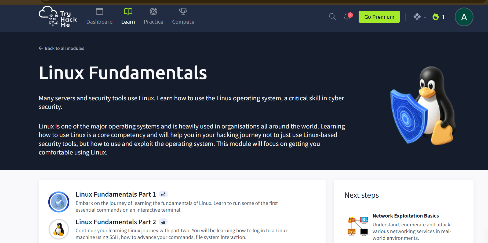
---

## TAREA 988

### Descripción:
Realizar el modulo de Windows Fundamentals de TryHackMe https://tryhackme.com/module/windows-fundamentals

### Evidencias:
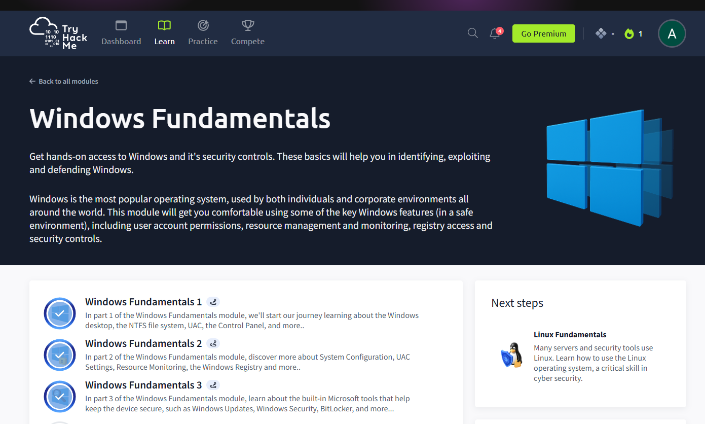

##  TAREA 987

## Descripción:
Construir un jail/challenge.

###  Evidencias:
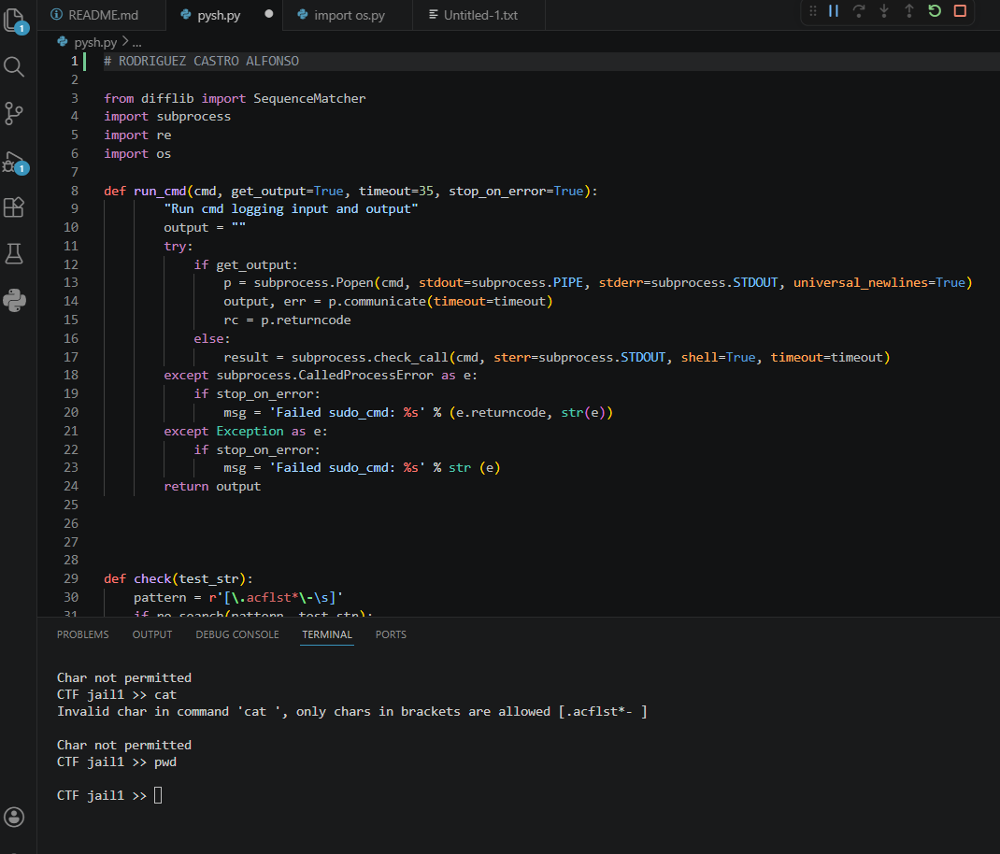

---

##  TAREA 986

## Descripción:
Grabar un asciinema ejecutando su menu en Bash.

###  Evidencias:

Mi asciinema: https://asciinema.org/a/AtkiCSlBjvGeOay2

---

##  TAREA 985

## Descripción:
Realizar en Python una herramienta que permita interactuar con el modulo "so".

###  Evidencias:
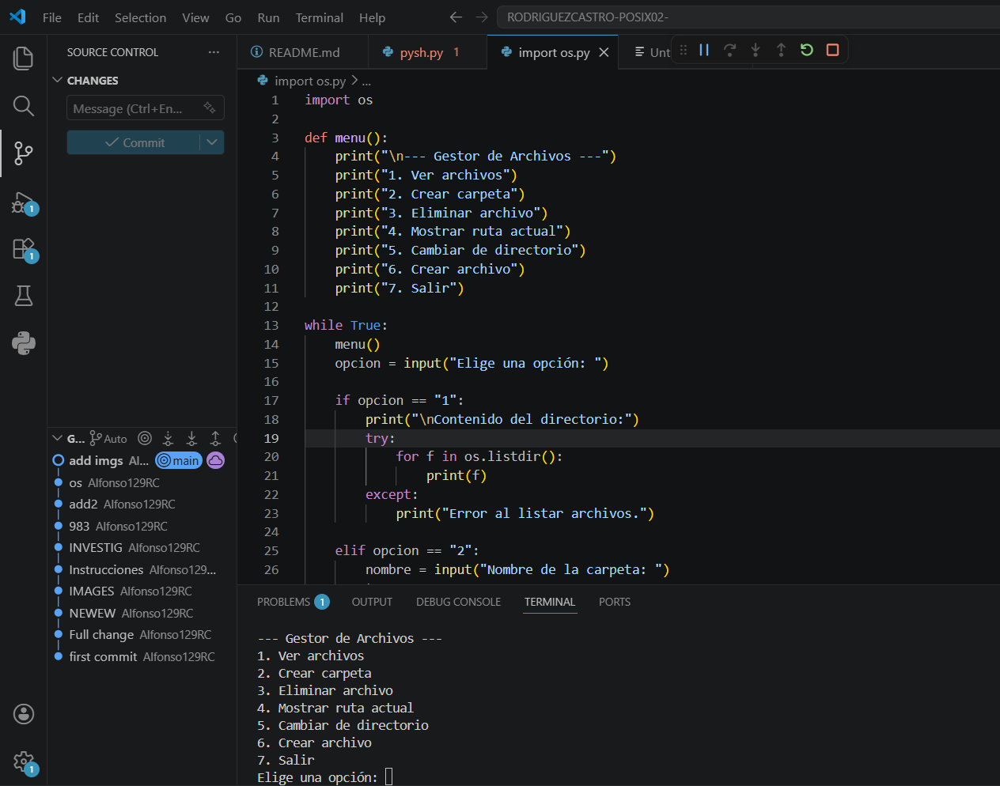

---

##  TAREA 984

## Descripción:
Compilar Linux siguiendo la guia de https://www.linuxfromscratch.org/

###  Evidencias:

---

##  TAREA 983

## Descripción:
Investigar sobre X11 en Linux, GNome, KDE y XFCE, poner la investigacion con Markdown en la wiki de su repositorio, o en un Markdown dentro de su repositorio. 

###  INVESTIGACION:

En los sistemas operativos basados en Unix/Linux, la interfaz gráfica no está integrada directamente en el núcleo del sistema, sino que se construye a partir de diferentes capas independientes. Esta arquitectura modular permite separar el manejo del hardware gráfico de la experiencia visual del usuario.
Dentro de este modelo, existen dos elementos clave: por un lado, el sistema gráfico que se encarga de la comunicación con la pantalla y los dispositivos de entrada, y por otro, los entornos de escritorio que proporcionan una interfaz completa e interactiva. Tecnologías como X11, junto con entornos como GNOME, KDE Plasma y Xfce, forman parte fundamental de esta estructura.

## X11 (X Window System)
El sistema X11 es una de las tecnologías más importantes en la historia de los sistemas Unix/Linux. Su función principal es proporcionar la infraestructura necesaria para que las aplicaciones gráficas puedan mostrarse en pantalla y recibir interacción del usuario.
A diferencia de un entorno de escritorio, X11 no define la apariencia visual de la interfaz. Su responsabilidad se limita a gestionar el hardware gráfico y facilitar la comunicación entre aplicaciones y dispositivos como el teclado, el ratón y la pantalla.
Uno de los aspectos más relevantes de X11 es su arquitectura cliente-servidor. En este modelo, el servidor X controla los recursos físicos del sistema, mientras que las aplicaciones actúan como clientes que solicitan dibujar elementos gráficos. Esta estructura permite incluso ejecutar aplicaciones en una máquina remota y visualizarlas en otra, lo cual fue una innovación clave en entornos de red.
Puntos importantes:
* Es la base del sistema gráfico en Unix/Linux.
* No define el diseño visual, solo la funcionalidad gráfica.
* Permite ejecución remota de aplicaciones.
* Funciona bajo modelo cliente-servidor.

## GNOME
El entorno GNOME es uno de los escritorios más utilizados en Linux. Su objetivo principal es ofrecer una experiencia de usuario sencilla, moderna y coherente.
GNOME integra todos los elementos necesarios para la interacción gráfica: ventanas, paneles, menús, aplicaciones básicas y herramientas de configuración. Su diseño se caracteriza por ser minimalista, reduciendo la complejidad para facilitar el uso, especialmente para usuarios nuevos.
A diferencia de otros entornos, GNOME limita la personalización avanzada con el fin de mantener consistencia y facilidad de uso. Esto lo convierte en una opción ideal para quienes buscan una experiencia directa y sin configuraciones complejas.
Puntos importantes:
* Interfaz moderna y minimalista.
* Fácil de usar.
* Alta integración entre aplicaciones.
* Mayor consumo de recursos.
* Enfocado en simplicidad.

## KDE (KDE Plasma)
El entorno KDE Plasma representa una alternativa orientada a la flexibilidad y personalización. A diferencia de GNOME, KDE permite modificar prácticamente todos los aspectos visuales y funcionales del escritorio.
Incluye una amplia variedad de herramientas y aplicaciones propias, lo que lo convierte en un entorno muy completo. Su apariencia suele ser más familiar para usuarios acostumbrados a sistemas como Windows, lo que facilita la transición.
KDE logra un equilibrio entre rendimiento y funcionalidad, ofreciendo una experiencia visual avanzada sin sacrificar eficiencia en equipos modernos.
Puntos importantes:
* Muy alto nivel de personalización.
* Interfaz atractiva y configurable.
* Gran cantidad de herramientas integradas.
* Buen rendimiento en hardware moderno.
* Enfocado en control total del usuario.

## XFCE
El entorno Xfce está diseñado con un enfoque en la ligereza y eficiencia. Su principal objetivo es ofrecer un entorno gráfico funcional que consuma pocos recursos del sistema.
XFCE mantiene una interfaz tradicional, sin efectos visuales complejos, lo que contribuye a su rapidez y estabilidad. Es especialmente utilizado en equipos antiguos o con limitaciones de hardware, aunque también es preferido por usuarios que buscan simplicidad.
A pesar de su sencillez, XFCE proporciona todas las herramientas necesarias para un uso completo del sistema.
Puntos importantes:
* Bajo consumo de recursos.
* Alta estabilidad.
* Interfaz sencilla y tradicional.
* Menor cantidad de efectos visuales.
* Ideal para equipos con pocos recursos.

## Conclusión
El entorno gráfico en sistemas Linux se construye a partir de una estructura modular que permite gran flexibilidad. X11 actúa como la base que hace posible la interacción gráfica, mientras que GNOME, KDE y XFCE ofrecen distintas experiencias de usuario sobre esa base.
Cada uno de estos entornos responde a necesidades específicas: GNOME prioriza la simplicidad, KDE la personalización y XFCE el rendimiento. Esta diversidad refleja uno de los principios fundamentales de Unix/Linux: la capacidad de adaptarse a distintos contextos y preferencias del usuario sin depender de una única solución.

---

##  TAREA 982

## Descripción:
Realizar todos los niveles de Bandit https://overthewire.org/wargames/bandit/ , crear un archivo de texto con los comandos utilizados para resolver cada nivel. Subir el archivo.

###  Evidencias:

---

##  TAREA 981

## Descripción:
Crear un menu en bash con los 18 scripts de la tarea 993

###  Evidencias:
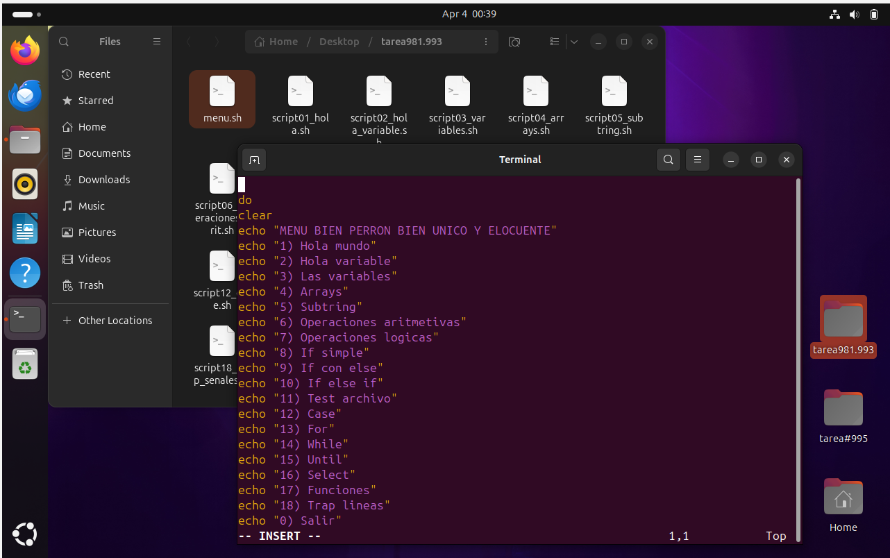

Codigo del Menu:

`#!/bin/bash`

`while true`
`do`
`clear`
`echo "===== MENU SCRIPTS SHELL ====="`
`echo "1) Hola mundo"`
`echo "2) Hola con variable"`
`echo "3) Variables"`
`echo "4) Arrays"`
`echo "5) Substring"`
`echo "6) Operaciones aritméticas"`
`echo "7) Operaciones lógicas"`
`echo "8) If simple"`
`echo "9) If else"`
`echo "10) If elseif"`
`echo "11) Test archivo"`
`echo "12) Case"`
`echo "13) For"`
`echo "14) While"`
`echo "15) Until"`
`echo "16) Select"`
`echo "17) Funciones"`
`echo "18) Trap señales"`
`echo "0) Salir"`
`echo "Seleccione opción: "`
`read opcion`

`case $opcion in`
    `1) ./script01_hola.sh ;;`
    `2) ./script02_hola_variable.sh ;;`
    `3) ./script03_variables.sh ;;`
    `4) ./script04_arrays.sh ;;`
    `5) ./script05_substring.sh ;;`
    `6) ./script06_operaciones_arit.sh ;;`
    `7) ./script07_operaciones_logicas.sh ;;`
    `8) ./script08_if_simple.sh ;;`
    `9) ./script09_if_else.sh ;;`
    `10) ./script10_if_elseif.sh ;;`
    `11) ./script11_test_archivo.sh ;;`
    `12) ./script12_case.sh ;;`
    `13) ./script13_for.sh ;;`
    `14) ./script14_while.sh ;;`
    `15) ./script15_until.sh ;;`
   ` 16) ./script16_select.sh ;;`
  `  17) ./script17_funciones.sh ;;`
 `   18) ./script18_trap_senales.sh ;;`
`    0) exit ;;`
`    *) echo "Opción inválida" ;;`
`esac`

`echo ""`
`read -p "Presiona Enter para continuar..."`
`done`

---

##  TAREA 980

## Descripción:
Realizar un script en bash que desglose las caracteristicas de un archivo

Que explique los permisos de un archivo
Que diga el tipo de archivo
El usuario y grupo
La ruta absoluta
Tamaño en bytes

Todas las caracteristicas que se muestran de un archivo al ejecutar el comando ls -al archivo.txt

En este caso el script recibirá como parametro el nombre del archivo del que se desea el detalle.

###  Evidencias:
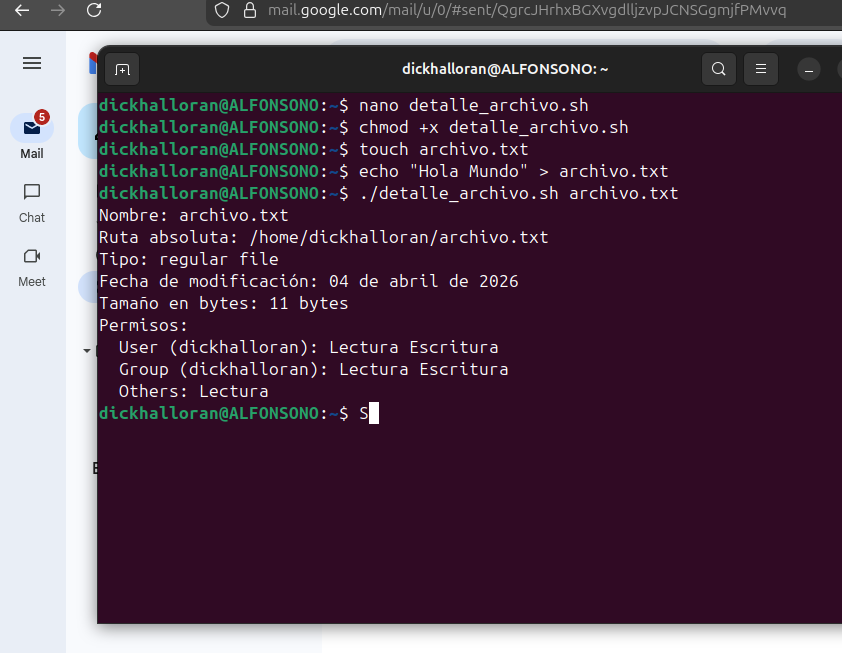

Link del Video: https://asciinema.org/a/IAfgdKglACozS718

Codigo:

#!/bin/bash

if [ $# -ne 1 ]; then
    echo "Uso: $0 nombre_archivo"
    exit 1
fi

archivo="$1"

if [ ! -e "$archivo" ]; then
    echo "El archivo no existe."
    exit 1
fi

nombre=$(basename "$archivo")
ruta=$(realpath "$archivo")
tipo=$(stat -c %F "$archivo")
tamano=$(stat -c %s "$archivo")
usuario=$(stat -c %U "$archivo")
grupo=$(stat -c %G "$archivo")
permisos=$(stat -c %A "$archivo")
fecha=$(stat -c %y "$archivo" | cut -d' ' -f1)

anio=$(echo $fecha | cut -d'-' -f1)
mes=$(echo $fecha | cut -d'-' -f2)
dia=$(echo $fecha | cut -d'-' -f3)

case $mes in
    01) mes_txt="enero";;
    02) mes_txt="febrero";;
    03) mes_txt="marzo";;
    04) mes_txt="abril";;
    05) mes_txt="mayo";;
    06) mes_txt="junio";;
    07) mes_txt="julio";;
    08) mes_txt="agosto";;
    09) mes_txt="septiembre";;
    10) mes_txt="octubre";;
    11) mes_txt="noviembre";;
    12) mes_txt="diciembre";;
esac

traducir_permisos() {
    local p=$1
    local resultado=""

    [[ ${p:0:1} == "r" ]] && resultado+="Lectura "
    [[ ${p:1:1} == "w" ]] && resultado+="Escritura "
    [[ ${p:2:1} == "x" ]] && resultado+="Ejecucion "

    echo $resultado
}

user_perm=$(echo $permisos | cut -c2-4)
group_perm=$(echo $permisos | cut -c5-7)
other_perm=$(echo $permisos | cut -c8-10)

echo "Nombre: $nombre"
echo "Ruta absoluta: $ruta"
echo "Tipo: $tipo"
echo "Fecha de modificación: $dia de $mes_txt de $anio"
echo "Tamaño en bytes: $tamano bytes"
echo "Permisos:"
echo "  User ($usuario): $(traducir_permisos $user_perm)"
echo "  Group ($grupo): $(traducir_permisos $group_perm)"
echo "  Others: $(traducir_permisos $other_perm)"

---

##  TAREA 979

## Descripción: 

Crear un juego en bash, dinamica de juego abierta. Subir codigo a su repositorio y asciinema de la ejecucion de su juego. Comentar la tematica y dinamica de su juego para ser autorizado.

Punto extra si es un juego didactico y no solo ludico. 

###  Evidencias:
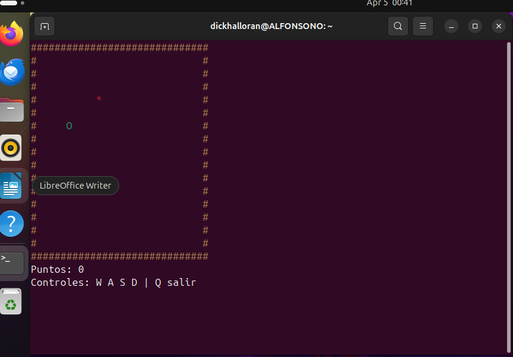
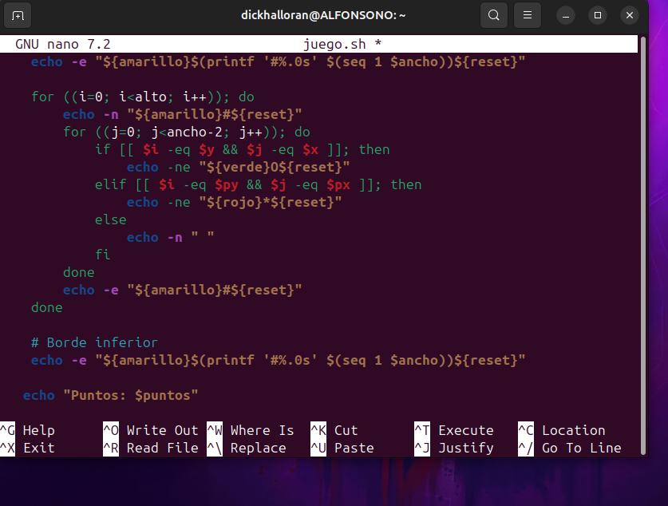

Gameplay: https://asciinema.org/a/W5A9xAytif0w8ErA

---